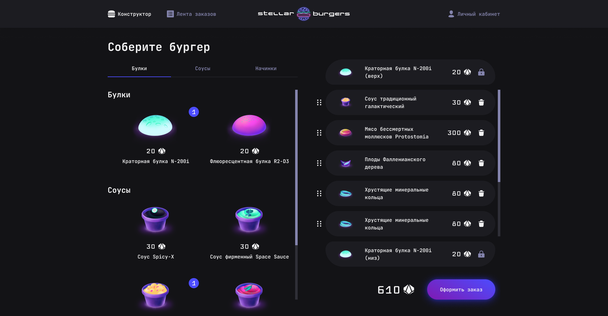

# Бургерная на краю Вселенной “Stellar Burgers”
## [Ссылка на готовый проект](https://stellar-burgers.oalbukova.nomoredomains.work/)
#### [Ссылка на макет](https://www.figma.com/file/vejDm3dVTUor3wBdNO137u/React-%2F-%D0%9F%D1%80%D0%BE%D0%B5%D0%BA%D1%82%D0%BD%D1%8B%D0%B5-%D0%B7%D0%B0%D0%B4%D0%B0%D1%87%D0%B8?node-id=0%3A1)

### Интерактивное многопользовательское приложение, позволяющее пользователю удобно собирать свой собственный специальный космический бургер с помощью конструктора.

##### Функционал:
* Регистрация пользователя
* Авторизация пользователя
* Забытый пароль (получение письма на электронную почту с кодом для сброса пароля)
* Конструктор заказов с возможностью выбора и изменение порядка ингредиентов методом drag-and-drop
* Оформление заказа
* Модальные окна: с детальным описанием выбранного ингредиента (при перезагрузке страницы модальное окно остается открытым), выбранного заказа (при перезагрузке страницы открывается отдельная страница с деталями заказа), номером заказа. 
* Личный кабинет пользователя с возможностью изменения данных.
* На вкладке "Лента заказов" можно увидеть список всех бургеров, которые готовятся прямо сейчас или уже готовы. Эта функция доступна в режиме реального времени благодаря подключению через веб-сокет.
* На странице профиля зарегистрированный пользователь может просмотреть историю своих заказов.
* Формы валидируются при заполнении

##### Технологии:
* React
* TypeScript
* Redux
* React Router
* CSS-модули
* Fetch API
* React-DND
* WebSockets
* Cookie && Local Storage
* 15 Cypress-тестов
* 60 Jest-тестов всех reducer

##### Установка
* Клонировать репозиторий
* Запустить `npm i` для установки зависимостей
* Запустить `npm start` для запуска приложения в режиме разработки
* Открыть http://localhost:3000/

##### Запуск Cypress-тестов
* Запустить `npm start` для запуска приложения в режиме разработки
* Запустить `npm run cypress` в другом окне терминала

##### Запуск Jest-тестов
* Запустить  `npm run test`

### [Ссылка на проект на GitHub Pages](https://oalbukova.github.io/REACT-BURGER/)
